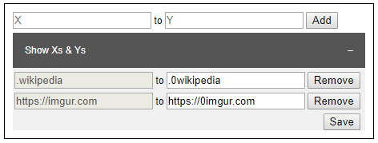

# X-2-Y
A chrome extension which replaces included strings with targeted strings of a URL and redirects to the new URL

### How to Load an Unpacked Extension into Chrome
Under extensions page which can be viewed by typing `chrome://extensions/` into URL bar above, enable developer mode. Then, click on `Load Unpacked` and choose the folder where manifest file and other files are in.

### How to Use X-2-Y
After successfully load the extension, an icon will occur top right of the chrome. By clicking the icon, a page will popup where any X-Y pairs can be added, changed and removed. Thus, the extension can redirect by looking into X-Y pairs.

### Screenshots

